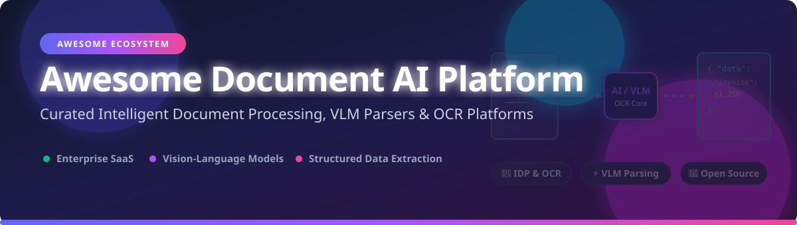

  

# 📄 Awesome Document AI Platform 🤖

  
  
  
  
  

## 🚀 Top Document AI & Intelligent Document Processing Ecosystem

**Curated Directory of Enterprise SaaS Products, Vision-Language Models (VLM) & Open-Source GitHub Repositories**

*Focused on Intelligent Document Processing (IDP), Optical Character Recognition (OCR), Layout Parsing & Schema-Constrained Data Extraction*

📅 **Last updated: September 2026**

---

## 🔍 Overview & Market Landscape

This repository tracks notable **SaaS platforms** and **open-source GitHub repositories** for **Document AI**. These solutions extract, classify, parse layout, and structure data from complex documents such as invoices, receipts, bills of lading, contracts, identity cards, and financial forms — powering end-to-end intelligent document processing (IDP) automation for finance, legal, healthcare, supply chain, and enterprise operations.

### 🌐 SaaS Document AI Market Overview
> 📊 **Market Size & Structure**: The global Intelligent Document Processing (IDP) / Document AI market was valued at **~$3.14 Billion in 2024** and is projected to expand rapidly to **~$15.57 Billion by 2032** (CAGR ~22.1%). The sector is **moderately fragmented**: hyper-scaler cloud vendors (*Microsoft Azure, Google Cloud, AWS*) dominate infrastructure and base OCR APIs, while specialized enterprise platforms (*Hyperscience, ABBYY, Rossum, Nanonets*) compete heavily on workflow automation, domain-specific extractors, human-in-the-loop (HITL) verification, and ERP integrations. It is **not a strict "winner-take-all" market**, as enterprise buyers frequently adopt multi-vendor solutions tailored to regulatory compliance, self-hosting needs, and document complexity.

---

## 📚 Table of Contents

- [☁️ SaaS / Hosted Platforms](#-saas--hosted-platforms)
- [⚡ Open-Source GitHub Projects](#-open-source-github-projects)
- [🛠️ Architecture & Integration Guide](#%EF%B8%8F-architecture--integration-guide)
- [🤝 How to Contribute](#-how-to-contribute)
- [💖 Support & Sponsorship](#-support--sponsorship)
- [📈 Star History](#-star-history)
- [⚠️ Disclaimer](#%EF%B8%8F-disclaimer)

---

## ☁️ SaaS / Hosted Platforms

| Company / Platform | Description | Starting Price 💰 | Free Tier Limit 🎁 | Company Size (Valuation / Revenue) 🏢 |
| :--- | :--- | :--- | :--- | :--- |
| **[Azure AI Document Intelligence](https://azure.microsoft.com/en-us/products/ai-services/ai-document-intelligence)** | Microsoft's document processing service with pre-built models and custom extraction for forms, invoices, and receipts. | $1.50 / 1,000 pages (Standard Read API) | Free (F0) tier: 500 pages/month (max 4MB file size) | **$3.1 Trillion** market cap (Microsoft) |
| **[Google Document AI](https://cloud.google.com/document-ai)** | Cloud-based document understanding platform with pre-trained models for invoices, receipts, forms, and custom extraction. | $1.50 / 1,000 pages (Standard OCR) | $300 free trial credits for new GCP accounts | **$2.0 Trillion** market cap (Alphabet) |
| **[Amazon Textract](https://aws.amazon.com/textract/)** | AWS's document text and data extraction service using machine learning for forms, tables, and structured data. | $1.50 / 1,000 pages (Detect Text API) | 1,000 pages/month for 3 months (Free Trial) | **$1.9 Trillion** market cap (Amazon) |
| **[Hyperscience](https://www.hyperscience.com/)** | Enterprise intelligent document processing platform with human-in-the-loop automation for complex document workflows. | $100,000+/year enterprise license | 14-day enterprise trial upon demo request | **$1.6 Billion** valuation |
| **[ABBYY](https://www.abbyy.com/)** | Comprehensive document AI and process intelligence platform with OCR, IDP, and content intelligence capabilities. | $16.50/month (FineReader PDF Standard) | 7-day free trial for desktop software | **$1.0 Billion+** valuation / ~$300M ARR |
| **[Rossum](https://rossum.ai/)** | AI-powered document automation platform specializing in invoice and purchase order processing with a focus on transactional documents. | $18,000/year (Starter Plan) | 14-day free trial (up to 300 docs/month limit) | **$500 Million** valuation / $45M ARR |
| **[Klippa](https://www.klippa.com/)** | Document automation platform with OCR and data extraction for receipts, invoices, and identity documents. | €5.00/user/month (SpendControl) | 14-day free trial / Free basic tier available | **$214.9 Million** valuation / $21.5M ARR |
| **[Nanonets](https://nanonets.com/)** | No-code AI document processing platform for extracting data from invoices, receipts, and forms with pre-built and custom models. | Pay-as-you-go ($0.02 - $0.30 per run) | $50 free trial credits (no credit card required) | **$116 Million** valuation / $100M ARR |
| **[Docsumo](https://www.docsumo.com/)** | AI-powered document processing platform with focus on financial documents and automated data extraction. | $500/month (Business Plan) | 1,000 free pages trial limit | **$107.7 Million** valuation / $10.3M ARR |
| **[Veryfi](https://www.veryfi.com/)** | Real-time document extraction API for receipts, invoices, and financial documents with mobile SDKs. | $19.99/user/month (SaaS) or $500/month minimum (API) | 100 documents/month free (OCR API) / 10 scans/month free (SaaS) | **$50 Million+** valuation / ~$12.8M total funding |

---

## ⚡ Open-Source GitHub Projects

The open-source ecosystem in 2026 offers transparent, self-hostable parsing engines, schema-constrained extractors, and vision-language models (VLMs) tailored for document intelligence. 

*Repositories below are sorted by GitHub Stars_Count (descending).*

| Project / Repository 📦 | GitHub_Stars ⭐ (Stargazers Link) | License 📄 | Description & Key Capabilities 💡 |
| :--- | :--- | :--- | :--- |
| **[PaddleOCR](https://github.com/PaddlePaddle/PaddleOCR)** |  | Apache 2.0 | Baidu's flagship ultra-lightweight OCR and document understanding toolkit supporting 80+ languages, table recognition, and LayoutLM. Includes **PaddleOCR-VL-1.6** (96.33% on OmniDocBench v1.6). |
| **[MinerU](https://github.com/opendatalab/MinerU)** |  | AGPL 3.0 | OpenDataLab's 1.2B structured extraction pipeline converting complex PDFs, formulas, tables, and scientific papers into clean Markdown and JSON. |
| **[Tesseract OCR](https://github.com/tesseract-ocr/tesseract)** |  | Apache 2.0 | The foundational open-source LSTM OCR engine supporting 100+ languages and line-level text recognition. |
| **[Docling](https://github.com/docling-project/docling)** |  | MIT | IBM Research's document processing framework. Converts complex PDFs/scans to structured JSON/Markdown with reading order preservation, table recognition, and visual grounding for RAG pipelines. |
| **[Surya](https://github.com/VikParuchuri/surya)** |  | GPL 3.0 | Multilingual OCR, document layout analysis, and reading order detection model supporting 90+ languages with benchmark-leading accuracy. |
| **[EasyOCR](https://github.com/JaidedAI/EasyOCR)** |  | Apache 2.0 | Ready-to-use Python OCR package supporting 80+ languages and popular frameworks (PyTorch). |
| **[olmOCR](https://github.com/allenai/olmocr)** |  | Apache 2.0 | Allen AI's industrial-scale PDF digitization tool achieving 82.4% on olmOCR-bench. Converts 1 million PDF pages for ~$190 using SGLang GPU inference. |
| **[DocTR](https://github.com/mindee/doctr)** |  | Apache 2.0 | Mindee's seamless OCR library powered by PyTorch and TensorFlow with structured JSON output (blocks, lines, words, bounding boxes). |
| **[lift](https://huggingface.co/datalab-to/lift)** |  | Apache 2.0 | Datalab's 9B parameter schema-constrained structured extraction model pulling JSON from PDFs with 90.2% field accuracy and 9.5s median latency. |
| **[Qianfan-OCR](https://huggingface.co/rootlocalghost/Qianfan-OCR)** |  | Open Model | Baidu Qianfan's 4B-parameter end-to-end model (#1 on OmniDocBench v1.5 with 93.12 score) with "Layout-as-Thought" reasoning for 192 languages. |
| **[NuExtract3](https://huggingface.co/numind/NuExtract3)** |  | Apache 2.0 | NuMind's structured extraction model supporting in-context learning, prompt templates, and Markdown OCR mode with 8.3s latency. |
| **[Qwen2.5-VL](https://huggingface.co/Qwen/Qwen2.5-VL-7B-Instruct)** |  | Apache 2.0 | Alibaba's vision-language model family (3B, 7B, 72B) for zero-shot structured extraction, visual grounding, and document Q&A. |
| **[TinyDoc-VLM](https://pypi.org/project/tinydoc-vlm/)** |  | Apache 2.0 | 256M-parameter document specialist VLM running on CPU, Raspberry Pi 5, or edge devices (<1GB VRAM) using SigLIP + SmolLM2 architecture. |
| **[Kreuzberg (xberg)](https://github.com/kreuzberg-dev/kreuzberg)** |  | MIT | High-performance document extraction engine supporting 101 formats, MCP server for AI agents, CLI, and REST API. |
| **[Receipt Wrangler](https://github.com/Receipt-Wrangler/receipt-wrangler)** |  | AGPL 3.0 | Self-hosted receipt management and tracking system with offline Tesseract OCR and LLM integration options. |
| **[AlienTables](https://pypi.org/project/AlienTables/)** |  | MIT | Privacy-first local PDF-to-Excel batch extraction engine with adaptive OCR fallback and audit CSV reporting. |

---

## 🛠️ Architecture & Integration Guide

For engineers constructing custom **Document AI Pipelines**:
* **Layout Parsing & RAG**: Use **Docling** or **MinerU** for converting unstructured PDFs into clean, semantically ordered Markdown/JSON chunkable for vector databases.
* **Schema-Constrained Extraction**: Use **lift** or **NuExtract3** when you require strict JSON outputs adhering strictly to Pydantic / JSON schemas.
* **Edge & Mobile Deployments**: Use **TinyDoc-VLM** or **EasyOCR** for on-device, offline processing with low VRAM footprint.
* **High-Volume Mass Digitization**: Deploy **olmOCR** with SGLang batching for maximum throughput and cost efficiency ($190/million pages).

---

## 🤝 How to Contribute

Contributions are warmly welcomed! Please follow these simple steps to add new Document AI tools or update existing entries:

1. **Fork** the repository.
2. Update [`README.md`](file:///C:/Users/hp/Documents/Projects/Awesome-Document-AI-Platform/README.md) following the table or list format.
3. Ensure entries include: tool name, direct link, concise description, starting price / Stars_Count, and license.
4. Submit a **Pull Request (PR)** with a clear title.

---

## 💖 Support & Sponsorship

If you find this curated Document AI ecosystem resource helpful, please consider supporting the maintenance of this list!

* ⭐ **Star** this repository to show your appreciation!
* 🔀 **Fork** and share it with fellow document processing engineers & AI researchers.
* ☕ **Buy me a coffee / Sponsor**: Support ongoing updates via the [GitHub Sponsor Dashboard](https://github.com/sponsors/ishandutta2007).

  

---

## 📈 Star History

---

## ⚠️ Disclaimer

- This directory is a **community-curated list** — provided for informational and educational purposes without endorsement.
- Document AI tools process sensitive financial, legal, and identity data. Self-hosted deployments require end-to-end encryption, access controls, and compliance with data privacy regulations (GDPR, CCPA, HIPAA).
- Model benchmark scores (e.g., OmniDocBench, olmOCR-bench) vary depending on dataset domain, document noise, and image quality.

---

  <i>Maintained with ❤️ for document processing engineers, AI researchers, and automation architects worldwide.</i>

